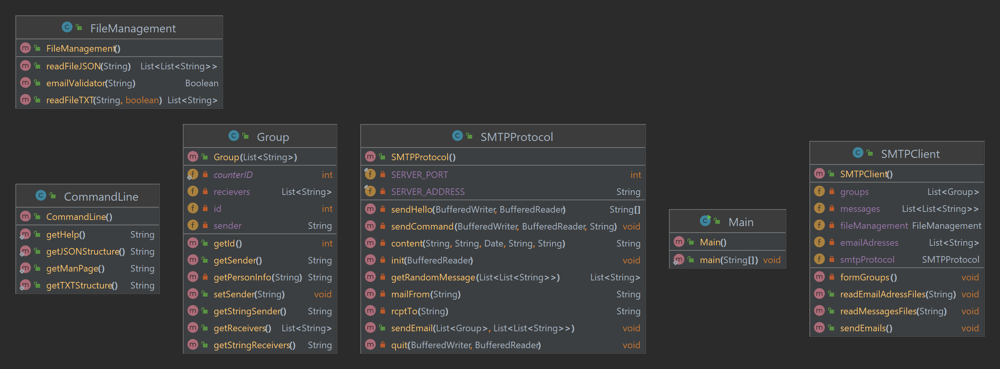

# Dai-lab-smtp

### Authors Ferrara Justin, Andrea Graf

## Introduction

The goal of this project is to send fake forged emails to a smtp sever. We developed a program that will read a list of
email addresses and a list of jokes. The program will send an emails to each email address with a random joke. To send
the email, the program will use the smtp server. In our case, we will use a MOCK smtp server called MailDev running in
a docker container. The program will connect once to the smtp server and send the emails and the close the connection.

We use Meaven to compile the program and create the jar file. The jar file is located in the target folder.

The senders and the receivers of the emails are stored in a text file. In order to determine which is the sender and 
which is the receiver, we will use the following convention: the first line of the file is the sender and the 4 next 
lines are the receivers. We're calling this a group (1 sender and 4 receivers).Each receiver will receive a message but the 
message are the same for receivers in the same group. The sender will not receive any message.

The files are utf-8 encoded. The program will read the files and send the emails also under utf-8 encoding due to the 
smtp standard (for the subject and the body of the email).

The messages are picked randomly from the json file.

## Default configuration
The default configuration is to connect to the server in localhost on port 1025 for using the MOCK smtp server described
below.

## MOCK SMTP server
The command to run the docker container:
```bash
docker run -d -p 1080:1080 -p 1025:1025 maildev/maildev
```
This command will run a MOCK smtp server called MailDev. The server will listen on port 1025 for smtp connection and on
port 1080 for the web interface. The web interface is accessible at http://localhost:1080.

## Real SMTP server
The program can also send emails to a real smtp server. To do so, you need to change the configuration of the program.
You can change the host and the port of the server [here](https://github.com/DAIFerraraGraf/dai-lab-smtp/blob/main/src/main/java/EmailSender/SMTPProtocol.java).
```java
public class SMTPProtocol() {
    // Change the host and the port of the smtp server
    public static final String SMTP_SERVER_ADDRESS = "localhost";
    public static final int SMTP_SERVER_PORT = 1025;
}
```

## Files
The victim's email address and the jokes are stored in different files. The program will read the file and send the
email to the smtp server.
### Emails.txt
The victim's email address are stored in a text file where each line are another email address. If the line is not a valid email address, it will not be taken into account.

An example of the email file:
```
jean.dupont@example.com
marie.martin@example.com
pierre.durand@example.com
```
### Content.json
The messages are stored in a json file. The file contain a single key-value pair. The key is "messages" and the value is an array of objects. 
Each object in the array represents an email message with two properties: "Subject" and "Body". Subject is the subject of
the email and Body is the content of the email.

An example of the json file:
```
{
    "messages" : [
        {
            "Subject" : "<subject>",
            "Body": "<body>"
        },
        {
            "Subject" : "<subject>",
            "Body": "<body>"
        },
        {
            "Subject" : "<subject>",
            "Body": "<body>"
        }
    ]
}
```

To start the program, run the following command:


## Compile the program
Use meaven to compile the program and create the jar file.
```bash
mvn clean package
```

## Run the program

Run the program with as argument the path to the email file and the path to the json file:
```bash
java --jar SpammerEmail-1.0-jar-with-dependencies.jar <emails.txt> <content.json>
```

## Help

To obtains further information about the program, run the following command:
Help:
```bash
java --jar SpammerEmail-1.0-jar-with-dependencies.jar --help
```
Information about the json file:
```bash
java --jar SpammerEmail-1.0-jar-with-dependencies.jar --json
```
Man page:
```bash
java --jar SpammerEmail-1.0-jar-with-dependencies.jar --man
```
## Example
A small example to run the program with the example files:
```bash
java --jar SpammerEmail-1.0-jar-with-dependencies.jar ./src/victims.txt ./src/jokes.json
```

# Dai-lab-smtp Implementation
## Design

### Main
The main class is the entry point of the program. It will read the arguments and create an instance of SMTPClient to 
precise the email file and the json file. It will then call the method sendEmails() to send the emails.

### CommandLine
The CommandLine class is used to identify the arguments passed to the program. It will print the help message if the
argument is --help. It will print the information about the json file if the argument is --json. If the arguments are 
null, it will also print the --help message.

### SMTPClient
The SMTPClient class is the class that will bring together all the other classes. It will read the files by 
calling the FileManager class. It will form the groups of senders and receivers by calling. And finally, it will send 
the emails by calling the SMTPProtocol class with the groups and the jokes.

### SMTPProtocol
The SMTPProtocol class is the class that will send the emails to the smtp server. It will create a socket and connect 
to the server. It will then send all the emails to the server and then close the connection for better performance (instead 
of opening and closing the connection for each email). The class will also handle the response of the server and throw 
an exception if the response is not valid.

### Group
The Group class is used to store the sender and the receivers of the email for each group. It also provide a method called
getPersonInfo(String email) to get the name of the person from the email address and display it correctly in the email.

### FileManagement
The FileManagement class is used to read the files from a json or a text file. It contains also a method to validate the 
email address.

## UML Diagram
